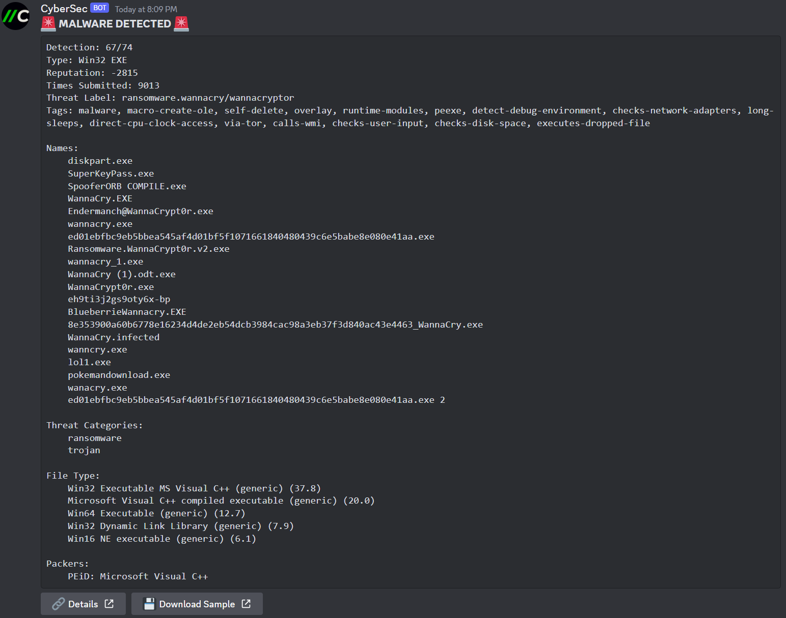
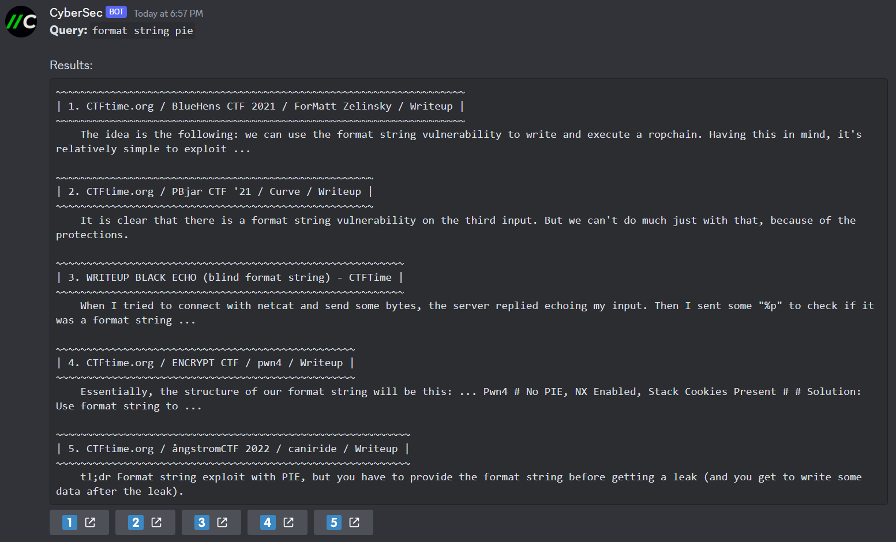
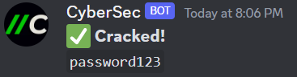

[](https://github.com/PyCQA/bandit)
[](https://github.com/fssecur3/cybersec/stargazers)
[](https://github.com/fssecur3/cybersec/blob/main/LICENSE.md)

# CYBERSEC DISCORD BOT

> An easy to use cybersecurity discord bot that attempts to make the life easier for individuals, teams and groups interested in researching, sharing, learning, or even playing some CTFs.

## DESCRIPTION

This bot makes use of several APIs and google dorks to search for the intended content.  
Features:

- Encode and decode text to or from `base64` and `URL`
- Search for CTF writeups, on [CTFtime](https://ctftime.org/), related to given keywords
- Verify if an hash belongs to a malicious file and get the details from that file (VirusTotal)
- Download malware samples by simply providing its hash
- Search and find details from CVEs
- Search for public exploits
- Search for cracked hashes

You should register on the platforms listed below to retrieve the API keys and get the full potential of the bot.

Used APIs (you can get the API keys from the links below):

- [NVD](https://nvd.nist.gov/developers/request-an-api-key)
- [Malshare](https://malshare.com/register.php)
- [Virustotal](https://www.virustotal.com/gui/join-us)

For security and management purposes, there are 2 log files being used: `access.log` and `error.log`. The first one reveals when, who and how a user tried to execute sensitive commands on the bot. The other one outlines runtime errors that might arouse from the bot. These are stored in the `logs` folder (created when the bot is executed for the first time).

All the code is verified using [Bandit](https://github.com/PyCQA/bandit) - security oriented static analyser for python code - before published.

*Note: The amount of information given by the several API commands (such as `writeup`, `vt`, `cve` and `exploit`) will depend on the availability from those external services and the amount of data retrieved from the search results. Some results contain more information than others.*

## INSTALL

Requirements:

- python3
- python3-pip
- git

### Windows

```bat
git clone https://github.com/fssecur3/cybersec
cd cybersec
pip install -r requirements.txt
```

### Linux

```sh
git clone https://github.com/fssecur3/cybersec
cd cybersec
./install.sh
```

You can set up the API keys right away by creating environment variables with the names shown at the end of the README and setting their value to the key. If you want to set them up later, you can use the bot command `set` to set the API keys.

## USAGE

There are some arguments (required and optional) to be passed when starting the bot:

```text
usage: cybersec [-h] -r role [-c channel] [-p prefix] [-V]

optional arguments:
  -h, --help            show this help message and exit
  -V, --version         show program's version number and exit

Settings:
  -r role, --management-role role               Management role
  -c channel, --management-channel channel      Management channel
  -p prefix, --prefix prefix                    Bot prefix (default: $)
```

The only required argument is the `management role`. Since API keys are sensitive content, only certain members (with a given role) should be able to see that content. You can specify that role using the `-r` tag. You can also, optionally, specify a text channel, with the `-c` flag, that forces the bot to only reply to sensitive commands (such as `env` and `set`) on that channel. This way, a manager/administrator can use the bot safely on community text channels without leaking any API keys or changing the bot settings.  
The prefix length is limited to a maximum of 7 characters, in case you want to change it (prefix suggestion: '`sudo `' 😉).

## HELP

On discord, you can get the bot help page by simply sending `$help` to the chat. The bot should answer with the following list of commands:

```text
Command     Description
------      -------
crack       crack a hash
cve         get details from a CVE
decode      decode a given string
encode      encode a given string
env         display the API keys
hello       be nice and greet me
help        shows this page
id          why not?
ping        check the bot latency
exploit     search for exploits
set         modify API keys or bot prefix
vt          search for a given hash on VirusTotal
whoami      who am I?
writeup     search for CTFtime writeups

Command     Arguments
------      ------
crack       <algorithm> <hash>
cve         <CVE>
decode      <b64|url> <text>
encode      <b64|url> <text>
exploit     <keyword> [<keyword> ...]
set         <prefix|API Variable> <value>
vt          <hash>
writeup     <keyword> [<keyword> ...]

Hash Algorithms
------
md5, md5-sha1, md5WithRSAEncryption, RSA-MD5, RSA-RIPEMD160, RSA-SHA1, RSA-SHA1-2, RSA-SHA224, RSA-SHA256, RSA-SHA3-224, RSA-SHA3-256, RSA-SHA3-384, RSA-SHA3-512, RSA-SHA384, RSA-SHA512, RSA-SHA512/224, RSA-SHA512/256, RSA-SM3, blake2b512, blake2s256, id-rsassa-pkcs1-v1_5-with-sha3-224, id-rsassa-pkcs1-v1_5-with-sha3-256, id-rsassa-pkcs1-v1_5-with-sha3-384, id-rsassa-pkcs1-v1_5-with-sha3-512, ripemd, ripemd160, ripemd160WithRSA, rmd160, sha1, sha1WithRSAEncryption, sha224, sha224WithRSAEncryption, sha256, sha256WithRSAEncryption, sha3-224, sha3-256, sha3-384, sha3-512, sha384, sha384WithRSAEncryption, sha512, sha512-224, sha512-224WithRSAEncryption, sha512-256, sha512-256WithRSAEncryption, sha512WithRSAEncryption, shake128, shake256, sm3, sm3WithRSAEncryption, ssl3-md5, ssl3-sha1

API Variables
------
MALSHARE_API_KEY
NVD_API_KEY
VIRUSTOTAL_API_KEY
```

## EXAMPLES

1. Searching for a CVE

Command: `$cve CVE-2020-1921`  


2. Getting information about a file hash and download link

Command: `$vt 84c82835a5d21bbcf75a61706d8ab549`  


3. Searching for writeups

Command: `$writeup format string pie`  


4. Encoding text

Command: `$encode b64 hello there`  


5. Searching for public exploits

Command: `$exploit goahead 2.1`  


Command: `$crack sha1 cbfdac6008f9cab4083784cbd1874f76618d2a97`


***Enjoy! 🙂***
